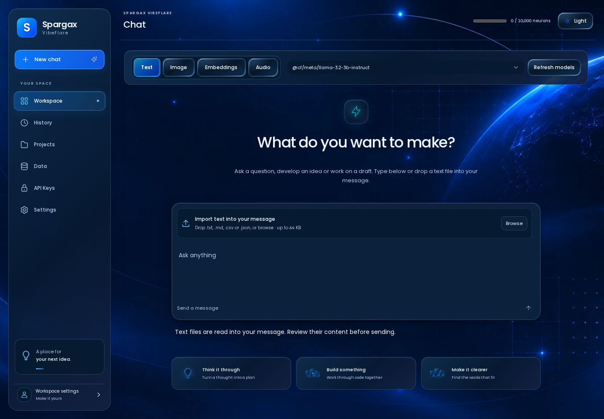
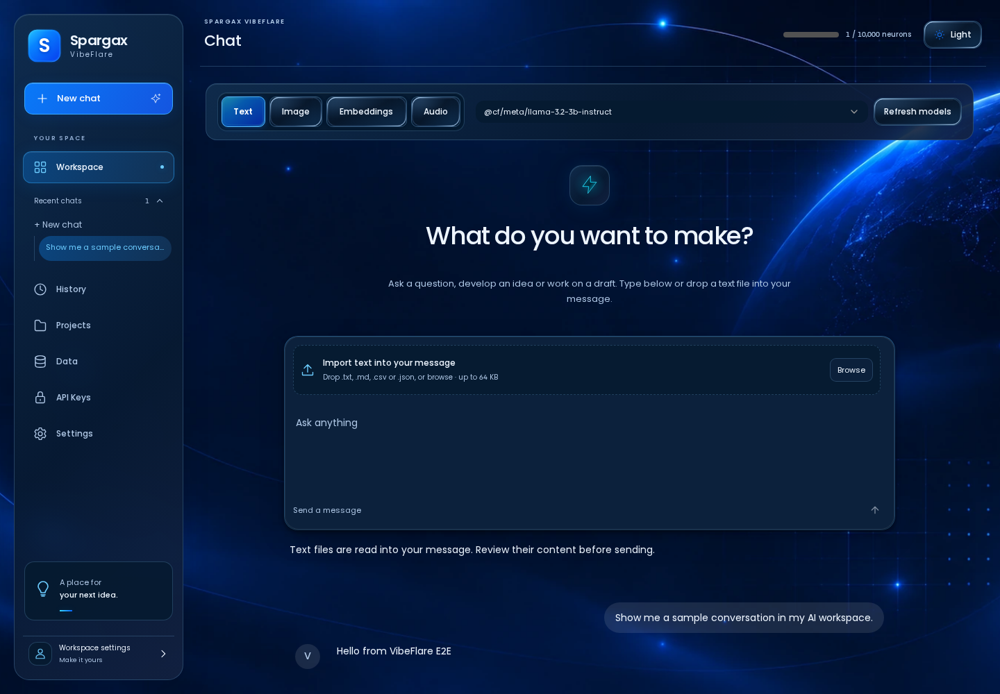
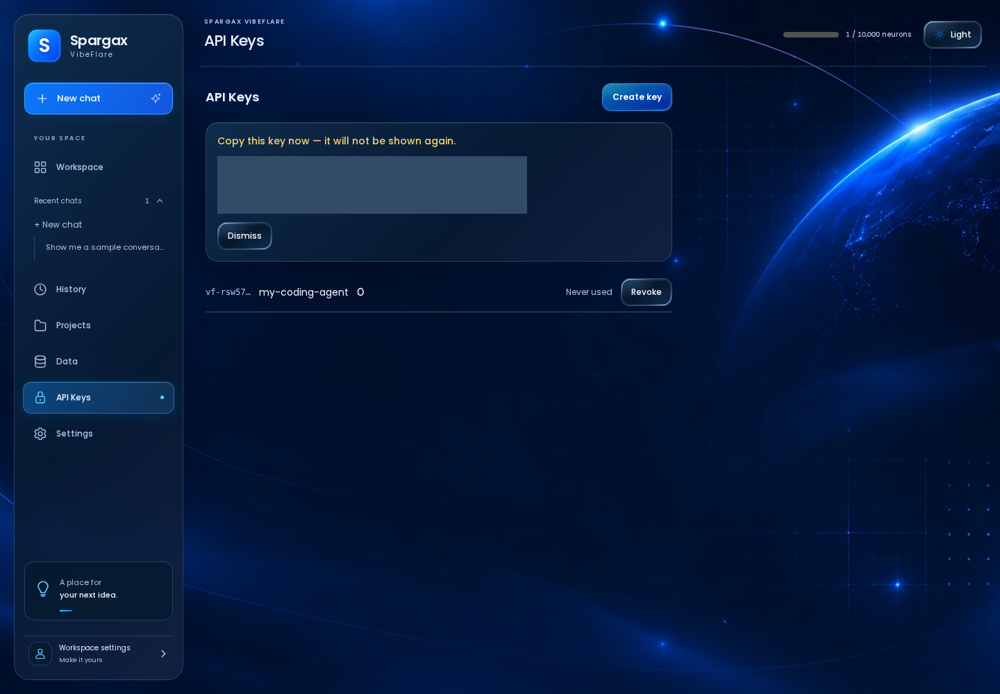
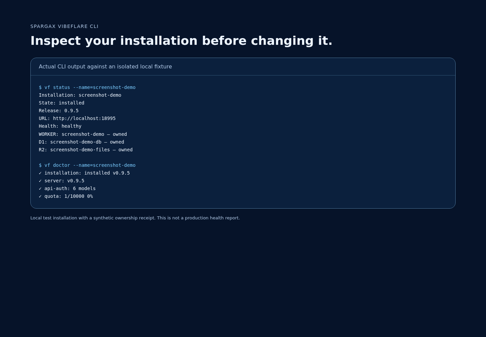

# VibeFlare

**Your own AI gateway on Cloudflare, with a normal web app and an OpenAI-compatible API.**

[](https://deploy.workers.cloudflare.com/?url=https://github.com/alexcodeplace/spargax-vibeflare)

### One-click install

Click **Deploy to Cloudflare** above, choose your Cloudflare account, and accept the generated resource names. Cloudflare provisions the Worker, D1 database, R2 bucket, Workers AI binding, and Durable Objects, runs the database migrations, builds the UI, and deploys VibeFlare. No terminal, API token, or pre-generated session secret is required.

When Cloudflare finishes, open the Worker URL. A fresh install routes you to `/setup`, where you can become the owner with GitHub or a passkey. **GitHub requires no deployment environment variables or pre-created OAuth credentials**: VibeFlare uses GitHub's App Manifest flow to create a small GitHub App owned by your GitHub account, then stores that instance's generated OAuth credentials privately in D1.

VibeFlare loads the full public Workers AI catalog directly from Cloudflare with no API token. The current model registry refreshes lazily when models are opened after 24 hours, and **Refresh models** forces an immediate sync. Known-good models are ranked first, with `@cf/meta/llama-3.2-3b-instruct` as the default text model. **Settings > Models > Exclude paid** is on by default. The owner can turn it off to include models marked **💲 Paid**. Classification reads Cloudflare’s explicit paid-access flag, not the presence of a price-table row. Only current, verified entries are offered. Metadata refresh and local titles make no synthetic inference calls.

Choose which models appear in your chat with the checkboxes at **Settings > Models** (`/settings/models/`). Choices save for your account and survive catalog refreshes. Every Settings section has its own URL, so it can be bookmarked or opened directly.

Saved conversations appear directly under **Workspace** as soon as the first message is submitted, without replacing the other menus. Titles come from the first message and do not consume neurons. See [model access and Workspace behavior](docs/model-access.md) for the policy and API details.

VibeFlare is for people building with AI who want one private place for Cloudflare Workers AI instead of wiring authentication, API keys, model lists, usage tracking, files, and chat history into every project themselves.

You deploy it to **your Cloudflare account**. You get:

- a browser chat UI;
- an OpenAI-compatible `/v1` API for apps and coding tools;
- API keys you can create and revoke;
- the full public Workers AI model catalog with automatic daily lazy refresh and preferred-model ranking;
- chat history and private file storage;
- usage and audit views;
- passkey login plus zero-config GitHub sign-in by default;
- an optional Cloudflare Access mode for a custom domain;
- `vf` commands for setup, health checks, updates, and safe uninstall.

You do **not** need to read or edit the source code to use VibeFlare.

## Screenshots

### Chat landing



### Browser chat



### API key creation



### CLI status and doctor



## What does it cost?

Cloudflare currently includes **10,000 Workers AI Neurons per day at no charge** on both Free and Paid Workers plans. VibeFlare shows the live neuron count consumed through that VibeFlare installation against the daily allocation and refreshes it after inference. The Cloudflare allocation is account-wide, so usage from other Workers AI apps in the same account is not visible to a zero-config VibeFlare install. Some models require a paid billing method even while free Neurons remain; Cloudflare currently allows those through Workers Paid or prepaid AI Gateway credits.

VibeFlare also uses Cloudflare Workers, D1, and R2. Those services have their own free allocations, limits, and paid pricing. VibeFlare itself does not add a usage fee; your Cloudflare plan and actual usage determine your Cloudflare bill.

Current Cloudflare pricing:

- Workers AI: https://developers.cloudflare.com/workers-ai/platform/pricing/
- Workers: https://developers.cloudflare.com/workers/platform/pricing/
- D1: https://developers.cloudflare.com/d1/platform/pricing/
- R2: https://developers.cloudflare.com/r2/pricing/

## Advanced: CLI-managed install

Use this path when you want VibeFlare to maintain a local ownership receipt for `vf status`, `vf update`, and receipt-authoritative `vf uninstall`. The one-click Cloudflare button above is the simplest install.

### 1. What you need

You need:

- a Cloudflare account;
- R2 enabled on that Cloudflare account (first-time R2 users may need to complete Cloudflare's activation/checkout flow; R2 includes free monthly usage);
- Node.js 22.12 or newer;
- Bun;
- Git if you are cloning the repository.

VibeFlare installs the project-local Wrangler version from this repository. Cloudflare recommends project-local Wrangler so a project keeps a known CLI version:

https://developers.cloudflare.com/workers/wrangler/install-and-update/

### 2. Download VibeFlare

```bash
git clone https://github.com/alexcodeplace/spargax-vibeflare.git
cd spargax-vibeflare
./install.sh
```

`install.sh` installs the locked dependencies, builds `vf`, and copies the command to `~/.local/bin`. You can always use `./vf` from the VibeFlare folder even if `~/.local/bin` is not on your PATH yet.

### 3. Sign Wrangler in to Cloudflare

From the VibeFlare folder:

```bash
pnpm exec wrangler login
```

A browser window opens. Sign in to the Cloudflare account where you want VibeFlare to live.

If `pnpm` is available only through Corepack, use:

```bash
corepack pnpm exec wrangler login
```

### 4. No model-catalog token required

VibeFlare reads Cloudflare's public Workers AI catalog directly. You do **not** need to create a Workers AI Read token, set an account-model secret, or maintain a model list yourself. The catalog is refreshed lazily once it is 24 hours old, and the UI includes **Refresh models** for an immediate sync.

### 5. Deploy

For the normal setup, use:

```bash
./vf setup
```

That creates a VibeFlare-owned Worker, D1 database, and R2 bucket, applies the database migrations, deploys the app, verifies `/health`, and records exactly which resources belong to this installation.

For a normal `workers.dev` install you do **not** need to know your workers.dev hostname beforehand. VibeFlare discovers it during setup and configures passkeys with the final URL automatically.

When setup finishes, it prints your URL and the next steps.

### 6. Create your owner account

Open the URL printed by setup and visit `/setup`.

Create your first passkey. That first account becomes the owner.

Then open **API Keys**, create a key, and connect the CLI:

```bash
./vf login https://YOUR-VIBEFLARE-URL
```

Paste the API key when asked.

Finally:

```bash
./vf doctor
```

A healthy installation should show the installation, server, API authentication, and quota checks as healthy.

## Use it

### Chat from the terminal

```bash
vf chat "Explain this regex in plain English"
```

### See available models

```bash
vf models
```

### Check your quota

```bash
vf usage
```

### See whether the installation is healthy

```bash
vf status
vf doctor
```

### Add VibeFlare to OpenCode

```bash
vf install opencode
```

This adds a `vibeflare` provider to your OpenCode config. VibeFlare backs up an existing config before changing it.

## Update without losing your data

Download/pull the newer VibeFlare release, install its dependencies, then from that release folder run:

```bash
./vf update
```

Update uses the durable install receipt. It reuses the same D1 database and R2 bucket, applies pending migrations, deploys the new release, health-checks it, and only then records the new release as installed.

If an update fails, VibeFlare keeps the previous installed-release record and marks the attempted update as failed instead of pretending it succeeded.

## Safe uninstall

First preview exactly what VibeFlare owns:

```bash
./vf uninstall --preview
```

Preview does not call a Cloudflare delete operation.

To permanently remove the installation **and its stored VibeFlare data**, run the confirmed command from a real terminal and repeat the exact installation name:

```bash
./vf uninstall --confirm=vibeflare
```

Wrangler may show an additional warning if another Cloudflare Worker depends on this Worker. VibeFlare deliberately refuses permanent Worker deletion from a non-interactive/CI process, because Wrangler otherwise auto-accepts that dependency warning. If you decline the warning, VibeFlare verifies that the Worker still exists and keeps the receipt retryable.

Deletion is receipt-based, not name-search-based. VibeFlare removes the recorded Worker first, deletes only R2 objects recorded by that installation's D1 database, removes the R2 bucket, then removes D1 last. If a step fails, later destructive steps stop and the receipt records where to resume safely.

## More than one installation

Give each installation a different name:

```bash
./vf setup --name=my-personal-ai
./vf setup --name=my-team-ai
```

Then select one explicitly:

```bash
./vf status --name=my-team-ai
./vf update --name=my-team-ai
./vf uninstall --name=my-team-ai --preview
```

If your Wrangler login can access multiple Cloudflare accounts, setup asks you to specify one with `--account=<id-or-name>` rather than guessing.

## Custom domain + Cloudflare Access

The default workers.dev + passkey setup is the simplest path. Use Cloudflare Access only when you already want your own domain/Zero Trust policy.

```bash
./vf setup \
  --mode=cf-access \
  --origin=https://ai.example.com \
  --access-team=YOUR_TEAM \
  --access-aud=YOUR_AUD
```

You can also provide the Access values through `VIBEFLARE_CF_ACCESS_TEAM` and `VIBEFLARE_CF_ACCESS_AUD`.

In Access mode, Cloudflare Access owns browser identity. VibeFlare deliberately does not mix Access login with passkey/GitHub browser login; this avoids the redirect-loop class of bug caused by competing authentication systems.

## GitHub login

Standalone deployments support GitHub without any deployment-time environment variable. On a fresh install, choose **Use GitHub** on `/setup`. VibeFlare sends you through GitHub's App Manifest flow, creates a least-privilege GitHub App owned by your GitHub account, stores that instance's generated OAuth client credentials privately in D1, and signs the creating GitHub account in as the VibeFlare owner. Subsequent owner/member GitHub logins use normal GitHub web OAuth.

If you already operate your own GitHub OAuth application and prefer the older Device Flow, you can still override the zero-config path with its public client id:

```bash
./vf setup --github-client-id=YOUR_CLIENT_ID
```

The Device Flow override still requires no GitHub client secret.

## Where does VibeFlare keep local state?

Deployment ownership is stored outside the source checkout:

```text
${XDG_STATE_HOME:-~/.local/state}/vibeflare/installations/
```

The receipt contains resource names/ids, auth mode, deployment URL, release state, and migration state. **It does not contain the Cloudflare API token or your VibeFlare API key.**

CLI API login is stored separately in `~/.config/vibeflare/config.json` with mode `0600`.

Do not delete the install receipt while the Cloudflare installation still exists. It is the authority VibeFlare uses to know what it may safely update or delete.

## OpenAI-compatible API

After creating an API key, use your VibeFlare URL as the API base:

```text
https://YOUR-VIBEFLARE-URL/v1
```

Authenticate with:

```text
Authorization: Bearer vf-...
```

Implemented OpenAI-style surfaces include chat completions, embeddings, image generation, speech-to-text, text-to-speech, and model listing. Exact model capability depends on the current Workers AI catalog and your Cloudflare plan.

## Security model

The short version:

- API keys are stored as SHA-256 hashes, not plaintext.
- Browser auth is either VibeFlare session auth **or** Cloudflare Access, never both at once.
- Passkeys are the default browser login for standalone installs.
- Authentication attempts are rate-limited.
- File downloads are user-scoped.
- Install/update/uninstall authority comes from a local ownership receipt instead of broad name matching.
- Setup-generated deployment config and secrets are kept outside the tracked source template.

The full user journeys that act as release contracts live in `docs/user_journeys/`.

If setup, update, login, or uninstall is interrupted, see [the recovery guide](docs/RECOVERY.md) before manually changing Cloudflare resources.

## Development

For contributors:

```bash
pnpm install --frozen-lockfile
pnpm build
pnpm test
pnpm validate:wrangler
pnpm --filter @vibeflare/ui test:e2e
```

The UI uses Astryx components/theme primitives. Browser journeys and the deterministic UI matrix are release gates, not optional screenshots.

## License

MIT. See `LICENSE`.
