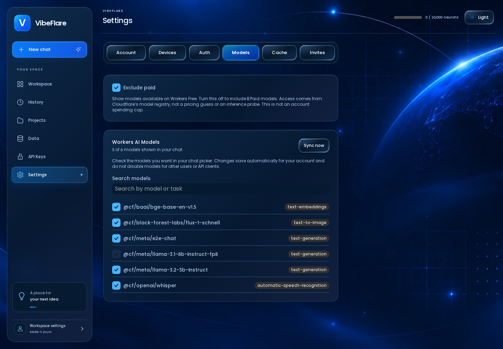
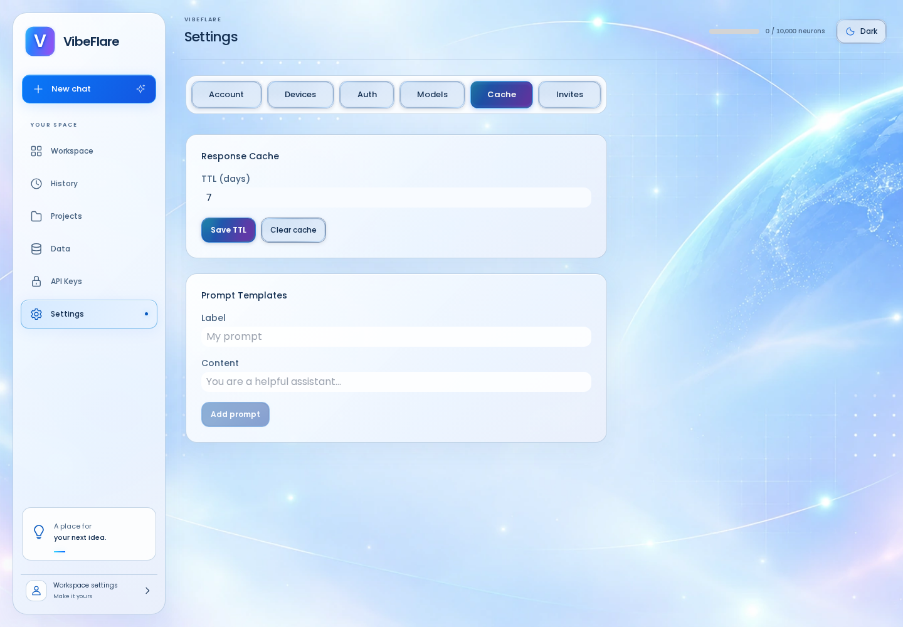
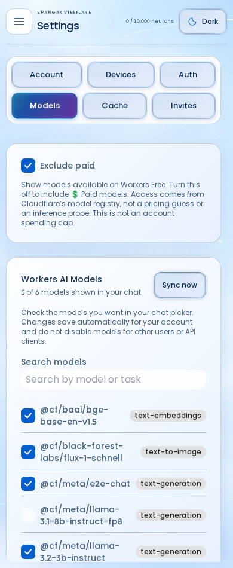
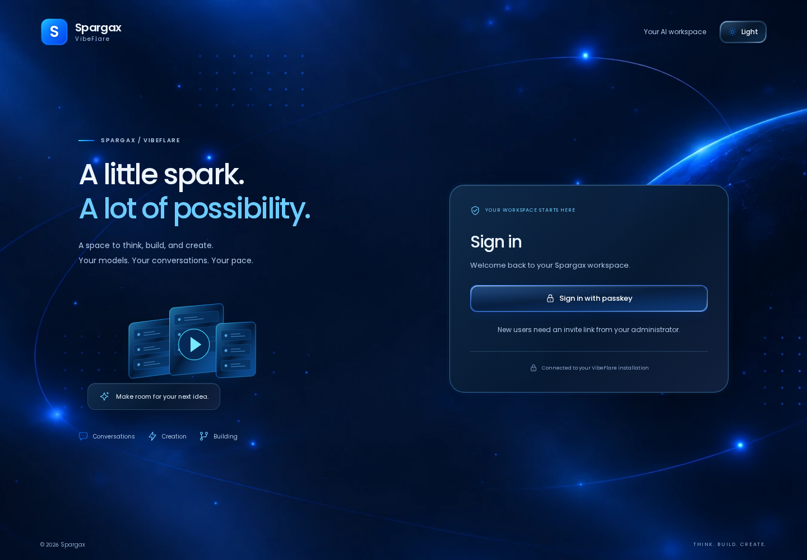

# VibeFlare

**Your AI workspace and API gateway, running in your own Cloudflare account.**

Chat in the browser, choose the models you use, manage API keys, and inspect usage from one place. Point your apps and coding tools at the same OpenAI-compatible `/v1` endpoint instead of building authentication, model selection, and request tracking into every project.

[](https://deploy.workers.cloudflare.com/?url=https://github.com/alexcodeplace/vibeflare)


VibeFlare is MIT-licensed, self-hosted software. You control the Cloudflare deployment, its data, and who can sign in. The browser includes dark and light themes, responsive navigation, and visible states for tabs and buttons.

## What is included

| Area | What you can do |
| --- | --- |
| **Workspace** | Stream a text conversation, switch models, stop a response, attach files, and reopen saved text, image, transcription and embedding conversations from the sidebar or History. Text starts on the task landing, then switches to the Astryx conversation layout after the first message so the newest turns sit directly above the bottom composer. Other tasks keep their stable input/results layout. |
| **Models** | Search the catalog, save your personal model checkboxes, and refresh metadata. The owner controls whether paid-access models are offered. |
| **API Keys** | Create labelled keys, reveal a new secret once, and revoke keys you no longer use. Owners can create admin keys. |
| **Files** | Manage private uploaded files at `/files`. |
| **Data** | Inspect usage summaries and request audit events at `/analytics`. |
| **Settings** | Open Account, Devices, Auth, Models, Cache, or the owner-only Invites section by its own URL. Manage passkeys, model choices, response-cache settings, prompt templates, and invitations. |
| **CLI and API** | Use `vf` for chat, models, usage, installation checks, updates, and receipt-based uninstall; integrate applications through `/v1`. |

### Current scope

Browser history covers text chats, generated images, audio transcripts and embedding requests. Reopening a conversation restores its task and saved results. **Embeddings** turns text into numerical vectors for similarity search or grouping; it is not a chatbot answer and does not build a search index for you. The browser tab now submits actual embedding requests and explains the task on entry. Text-to-speech remains an API capability, not a browser speech-generation screen.

Task inputs differ intentionally. Text chat can attach files; Image and Embeddings accept `.txt`/`.md` prompt imports rather than promising image-to-image editing. Audio accepts recording files up to 25 MB and sends them only when you click **Transcribe**. The interface checks model compatibility and normalizes audio for the selected provider contract; availability still depends on that model and account.

Model capabilities and access depend on the selected provider model and your account. The screenshots below demonstrate the actual interface using isolated test data, not successful production inference across every modality.

## Screenshots

These captures were refreshed from the **v0.9.6 source on main, including the shared-control and task-layout refresh**, on 2026-09-13. They use the real production UI build served by an isolated local test Worker. Account details, model entries, conversation responses, and CLI ownership data are fixtures. The API-key secret is masked. They are not mockups and do not certify the state of an existing live deployment.

[Capture provenance and regeneration instructions](docs/screenshots/README.md) include the source commit, build hashes, viewport sizes, themes, and image checksums.

### Personal model choices and clear Settings navigation

Use **Settings > Models** to search the catalog and choose what appears in your chat picker. Changes save per account without disabling the model for another user or API client. Direct section links support reload, Back/Forward, and opening a section in another tab.



### A conversation with saved history

The sidebar's **Recent chats** list updates when a conversation is created, including image, audio and embedding tasks. Titles come from the first message rather than an extra model call. This screenshot intentionally retains the local fixture's response text.


### Light theme

The same control assets have light-theme variants. Primary actions, secondary actions, disabled states, and the selected section remain visually distinct.



<details>
<summary>More screenshots: mobile, sign-in, API keys, and CLI checks</summary>

### Mobile Settings

Settings sections wrap into separate targets instead of squeezing their labels into one line. This is the 390px-wide interface, not a scaled desktop screenshot.



### Sign-in

The local fixture shown here offers passkey sign-in.



### API-key creation

A new key is revealed once. The secret block in this capture is deliberately masked, even though it belongs only to the disposable local fixture.


### CLI status and doctor

This image renders actual `vf status` and `vf doctor` output in a terminal-style frame. The commands ran against the isolated local Worker with a synthetic ownership receipt; this is not a production health report.


</details>

## Which problem does it solve?

You can stop wiring a separate provider connection into every prototype. VibeFlare gives you a browser workspace for everyday AI tasks and one authenticated `/v1` gateway for your apps, with model choices, revocable keys and usage records in the same installation. It is self-hosted software, not free provider compute.

### Three practical examples

**Build an app against your own endpoint.** Deploy VibeFlare, create a labelled API key, and configure the app's OpenAI-compatible base URL as `https://YOUR-VIBEFLARE-URL/v1`. Choose a model from your instance's `/v1/models` list; do not copy an unrelated provider's model name. Revoke the key when the prototype is retired.

**Turn a recording into a reusable transcript.** Open Workspace > Audio, select a compatible speech-recognition model, drop an MP3/WAV/M4A/OGG/WebM/FLAC recording into the audio area, and click Transcribe. Reopen the saved audio conversation from History. The operation processes the selected file; it does not continuously record your microphone.

**Explore semantic search inputs.** Open Embeddings, enter two short descriptions separately or import a text file, and generate vectors using the same model. The returned numbers are the building blocks an application can compare for similarity; the tab is not itself a document-search database. Keep private material out of experimental requests until you have reviewed your deployment and provider settings.

## Ask an agent to install and set it up

```text
Install VibeFlare for me using
https://github.com/alexcodeplace/vibeflare and its current README.
Inspect my environment and any existing VibeFlare install receipt first.
Preserve an existing installation; use its update/recovery workflow rather than
creating duplicate resources. Ask me to choose the Cloudflare account and
confirm resource creation or any billable action. Do not enable paid models,
change production DNS, or delete resources without my explicit approval.
For a new CLI-managed install, check Node, Bun, pinned pnpm/Wrangler and R2,
install the CLI, authenticate through the documented local/browser flow, and
run vf setup. Keep tokens and API keys out of logs, Git and this chat.
Guide me through /setup to create the owner account; do not impersonate me or
invent passkeys. Verify /health, vf status and vf doctor, then show the Workspace
URL and /v1 API base. Ask before making a real model request. Explain model
selection, text/image/audio/embedding history, and the difference between
Exclude paid and a spending cap. Finish with the install receipt location,
update instructions, and the non-destructive uninstall preview command.
```

## One-click install

Click **Deploy to Cloudflare**, choose your account, and accept the generated resource names. The deployment configuration provisions the Worker, D1 database, R2 bucket, Workers AI binding, and Durable Objects, runs migrations, builds the UI, and deploys the app. This path does not require entering an API token or generating a session secret in a terminal.

Open the Worker URL when deployment finishes. A fresh standalone installation routes to `/setup`, where the first user can become the owner with a passkey or GitHub. The GitHub setup path uses the App Manifest flow to create a GitHub App owned by your account and stores the generated OAuth credentials privately in D1. You do not have to create those credentials before deployment.

### Your first session

Open **Workspace**, choose a text model, and send a message. Open **Settings > Models** to choose which models appear in your picker. Open **API Keys** to create a key for another application, then use your Worker URL followed by `/v1` as its API base. Owners can invite another user from **Settings > Invites**.

The catalog refreshes lazily after 24 hours, and **Refresh models** requests an immediate metadata sync. The picker prioritizes configured preferred models; `@cf/meta/llama-3.2-3b-instruct` is the preferred text default when it is available and selected. Models without verified paid-access metadata are not offered. Catalog refresh and chat-title generation do not make synthetic inference calls.

**Exclude paid** is on by default. The owner can turn it off to offer models marked **💲 Paid**. This classification uses Cloudflare's explicit access metadata, not the presence of a price-table row. It is a model filter, **not an account spending cap**. See [model access and Workspace behavior](docs/model-access.md) for the policy and API details.

## What does it cost?

VibeFlare itself adds no application usage fee. Workers AI, Workers, D1, and R2 are Cloudflare services with their own allocations, limits, and billing. Your account plan, enabled models, and actual usage determine the provider bill.

The quota indicator reports usage through this VibeFlare installation. It does not include requests from other Workers AI applications in the same Cloudflare account, so it should not be treated as a complete account-wide billing dashboard. Enabling a paid model does not establish that your account has the required provider access or budget.

Check the provider's current terms before enabling paid usage:

- [Workers AI pricing](https://developers.cloudflare.com/workers-ai/platform/pricing/)
- [Workers pricing](https://developers.cloudflare.com/workers/platform/pricing/)
- [D1 pricing](https://developers.cloudflare.com/d1/platform/pricing/)
- [R2 pricing](https://developers.cloudflare.com/r2/pricing/)

## Advanced: CLI-managed install

Use this path when you want VibeFlare to maintain a local ownership receipt for `vf status`, `vf update`, and receipt-authoritative `vf uninstall`. The one-click Cloudflare button above is the simplest install.

### 1. What you need

You need:

- a Cloudflare account;
- R2 enabled on that Cloudflare account (first-time R2 users may need to complete Cloudflare's activation/checkout flow; R2 includes free monthly usage);
- Node.js 22.12 or newer;
- Bun;
- Git if you are cloning the repository.

VibeFlare installs the project-local Wrangler version from this repository. Cloudflare recommends project-local Wrangler so a project keeps a known CLI version:

https://developers.cloudflare.com/workers/wrangler/install-and-update/

### 2. Download VibeFlare

```bash
git clone https://github.com/alexcodeplace/vibeflare.git
cd vibeflare
./install.sh
```

`install.sh` installs the locked dependencies, builds `vf`, and copies the command to `~/.local/bin`. You can always use `./vf` from the VibeFlare folder even if `~/.local/bin` is not on your PATH yet.

### 3. Sign Wrangler in to Cloudflare

From the VibeFlare folder:

```bash
pnpm --filter @vibeflare/worker exec wrangler login
```

A browser window opens. Sign in to the Cloudflare account where you want VibeFlare to live.

If `pnpm` is available only through Corepack, use:

```bash
corepack pnpm --filter @vibeflare/worker exec wrangler login
```

### 4. No model-catalog token required

VibeFlare reads Cloudflare's public Workers AI catalog directly. You do **not** need to create a Workers AI Read token, set an account-model secret, or maintain a model list yourself. The catalog is refreshed lazily once it is 24 hours old, and the UI includes **Refresh models** for an immediate sync.

### 5. Deploy

For the normal setup, use:

```bash
./vf setup
```

That creates a VibeFlare-owned Worker, D1 database, and R2 bucket, applies the database migrations, deploys the app, verifies `/health`, and records exactly which resources belong to this installation.

For a normal `workers.dev` install you do **not** need to know your workers.dev hostname beforehand. VibeFlare discovers it during setup and configures passkeys with the final URL automatically.

When setup finishes, it prints your URL and the next steps.

### 6. Create your owner account

Open the URL printed by setup and visit `/setup`.

Create your first passkey. That first account becomes the owner.

Then open **API Keys**, create a key, and connect the CLI:

```bash
./vf login https://YOUR-VIBEFLARE-URL
```

Paste the API key when asked.

Finally:

```bash
./vf doctor
```

A healthy installation should show the installation, server, API authentication, and quota checks as healthy.

## Use it

### Chat from the terminal

```bash
vf chat "Explain this regex in plain English"
```

### See available models

```bash
vf models
```

### Check your quota

```bash
vf usage
```

### See whether the installation is healthy

```bash
vf status
vf doctor
```

### Add VibeFlare to OpenCode

```bash
vf install opencode
```

This adds a `vibeflare` provider to your OpenCode config. VibeFlare backs up an existing config before changing it.

## Update without losing your data

Download/pull the newer VibeFlare release, install its dependencies, then from that release folder run:

```bash
./vf update
```

Update uses the durable install receipt. It reuses the same D1 database and R2 bucket, applies pending migrations, deploys the new release, health-checks it, and only then records the new release as installed.

If an update fails, VibeFlare keeps the previous installed-release record and marks the attempted update as failed instead of pretending it succeeded.

## Safe uninstall

First preview exactly what VibeFlare owns:

```bash
./vf uninstall --preview
```

Preview does not call a Cloudflare delete operation.

To permanently remove the installation **and its stored VibeFlare data**, run the confirmed command from a real terminal and repeat the exact installation name:

```bash
./vf uninstall --confirm=vibeflare
```

Wrangler may show an additional warning if another Cloudflare Worker depends on this Worker. VibeFlare deliberately refuses permanent Worker deletion from a non-interactive/CI process, because Wrangler otherwise auto-accepts that dependency warning. If you decline the warning, VibeFlare verifies that the Worker still exists and keeps the receipt retryable.

Deletion is receipt-based, not name-search-based. VibeFlare removes the recorded Worker first, deletes only R2 objects recorded by that installation's D1 database, removes the R2 bucket, then removes D1 last. If a step fails, later destructive steps stop and the receipt records where to resume safely.

## More than one installation

Give each installation a different name:

```bash
./vf setup --name=my-personal-ai
./vf setup --name=my-team-ai
```

Then select one explicitly:

```bash
./vf status --name=my-team-ai
./vf update --name=my-team-ai
./vf uninstall --name=my-team-ai --preview
```

If your Wrangler login can access multiple Cloudflare accounts, setup asks you to specify one with `--account=<id-or-name>` rather than guessing.

## Custom domain + Cloudflare Access

The default workers.dev + passkey setup is the simplest path. Use Cloudflare Access only when you already want your own domain/Zero Trust policy.

```bash
./vf setup \
  --mode=cf-access \
  --origin=https://ai.example.com \
  --access-team=YOUR_TEAM \
  --access-aud=YOUR_AUD
```

You can also provide the Access values through `VIBEFLARE_CF_ACCESS_TEAM` and `VIBEFLARE_CF_ACCESS_AUD`.

In Access mode, Cloudflare Access owns browser identity. VibeFlare deliberately does not mix Access login with passkey/GitHub browser login; this avoids the redirect-loop class of bug caused by competing authentication systems.

## GitHub login

Standalone deployments support GitHub without any deployment-time environment variable. On a fresh install, choose **Use GitHub** on `/setup`. VibeFlare sends you through GitHub's App Manifest flow, creates a least-privilege GitHub App owned by your GitHub account, stores that instance's generated OAuth client credentials privately in D1, and signs the creating GitHub account in as the VibeFlare owner. Subsequent owner/member GitHub logins use normal GitHub web OAuth.

If you already operate your own GitHub OAuth application and prefer the older Device Flow, you can still override the zero-config path with its public client id:

```bash
./vf setup --github-client-id=YOUR_CLIENT_ID
```

The Device Flow override still requires no GitHub client secret.

## Where does VibeFlare keep local state?

Deployment ownership is stored outside the source checkout:

```text
${XDG_STATE_HOME:-~/.local/state}/vibeflare/installations/
```

The receipt contains resource names/ids, auth mode, deployment URL, release state, and migration state. **It does not contain the Cloudflare API token or your VibeFlare API key.**

CLI API login is stored separately in `~/.config/vibeflare/config.json` with mode `0600`.

Do not delete the install receipt while the Cloudflare installation still exists. It is the authority VibeFlare uses to know what it may safely update or delete.

## OpenAI-compatible API

After creating an API key, use your VibeFlare URL as the API base:

```text
https://YOUR-VIBEFLARE-URL/v1
```

Authenticate with:

```text
Authorization: Bearer vf-...
```

Implemented OpenAI-style surfaces include chat completions, embeddings, image generation, speech-to-text, text-to-speech, and model listing. Exact model capability depends on the current Workers AI catalog and your Cloudflare plan.

## Security model


- API keys are stored as SHA-256 hashes, not plaintext.
- Browser auth is either VibeFlare session auth **or** Cloudflare Access, never both at once.
- Passkeys are the default browser login for standalone installs.
- Authentication attempts are rate-limited.
- File downloads are user-scoped.
- Install/update/uninstall authority comes from a local ownership receipt instead of broad name matching.
- Setup-generated deployment config and secrets are kept outside the tracked source template.

The full user journeys that act as release contracts live in `docs/user_journeys/`.

If setup, update, login, or uninstall is interrupted, see [the recovery guide](docs/RECOVERY.md) before manually changing Cloudflare resources.

## Development

For contributors:

```bash
pnpm install --frozen-lockfile
pnpm build
pnpm test
pnpm validate:wrangler
pnpm --filter @vibeflare/ui test:e2e
```

The UI combines Astryx semantic components with the shared ecosystem Club asset kit. `Button` and `Tabs` adapters supply consistent visible control states in both themes, including linked Settings sections. This is not a claim of legal accessibility certification.

Browser journeys and the deterministic UI matrix verify user flows. README captures have a separate [reproducible screenshot workflow](docs/screenshots/README.md); they do not replace those tests.

## License

MIT. See `LICENSE`.
